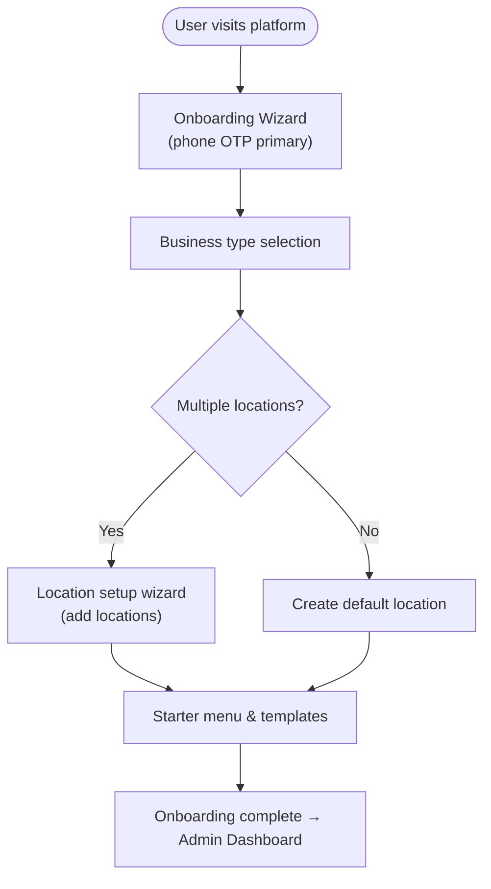
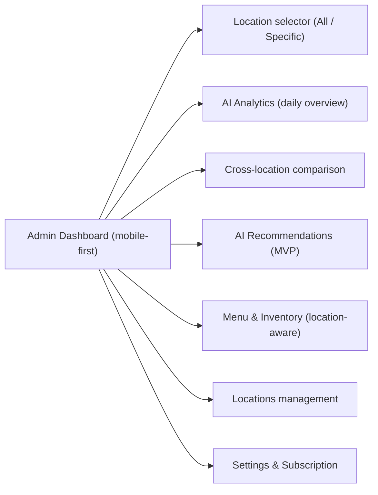
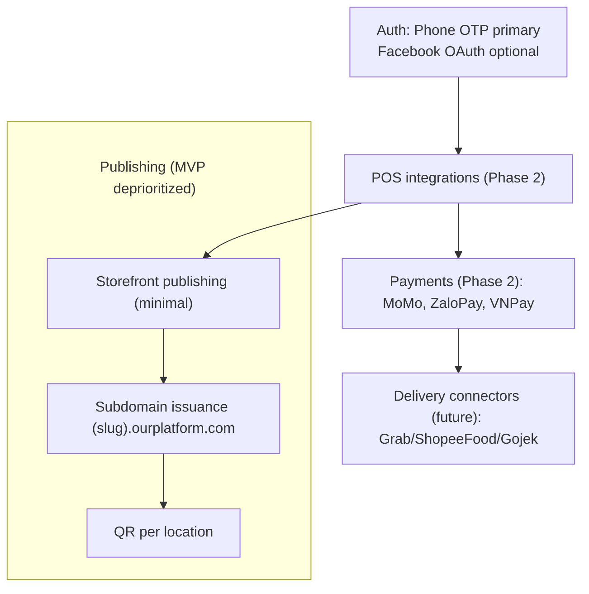
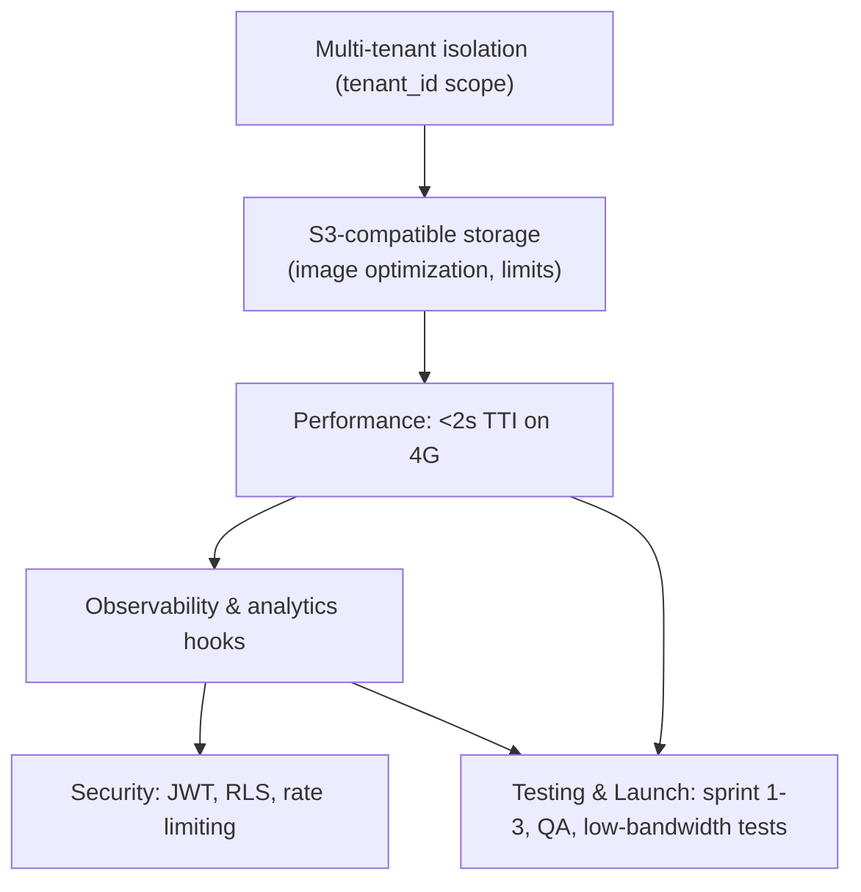

# Platform Plan Flowchart

Below is a set of focused Mermaid diagrams (split for readability). If you prefer a single diagram, we can keep a combined view — but splitting makes it easy to zoom and edit each area.

## Onboarding flow



## Admin dashboard (analytics-first)



## Integrations & Publishing (phased)



## Infra, Non-functional & Testing



## Legend & Notes

- This diagram maps the primary user flow (onboarding → dashboard → publish) and cross-cutting concerns (integrations, multi-tenancy, infra, testing).
- VN-specific items are emphasized: Zalo OAuth, MoMo/ZaloPay/VNPay, vi-VN & VND defaults, VN templates and sample menu items.
- Data isolation: all DB queries and storage keys must be scoped by `tenant_id`.
- Small, offline-friendly drafts are recommended for the admin dashboard.

## How to preview

- In VS Code: open `design/flowchart.md` and use a Mermaid preview extension (e.g., "Markdown Preview Mermaid Support") or the built-in Markdown preview if it supports Mermaid.

## Optional: export to PNG (local)

If you want a PNG, install mermaid-cli (requires Node):

```bash
# zsh
npm install -g @mermaid-js/mermaid-cli
mmdc -i design/flowchart.md -o design/flowchart.png
```

(If `mmdc` complains about reading a full markdown file, copy the Mermaid code block into a `.mmd` file first.)
